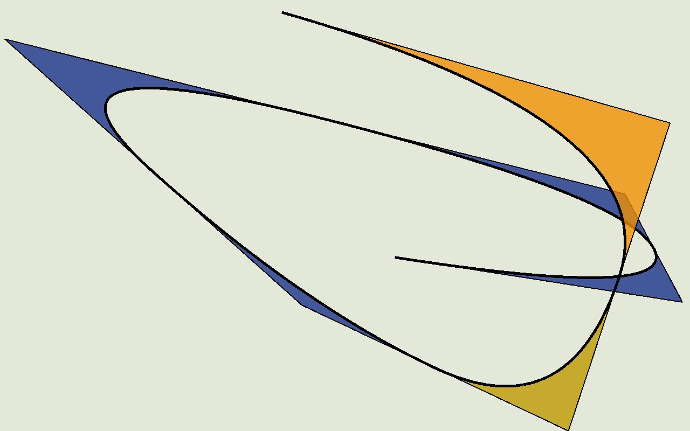
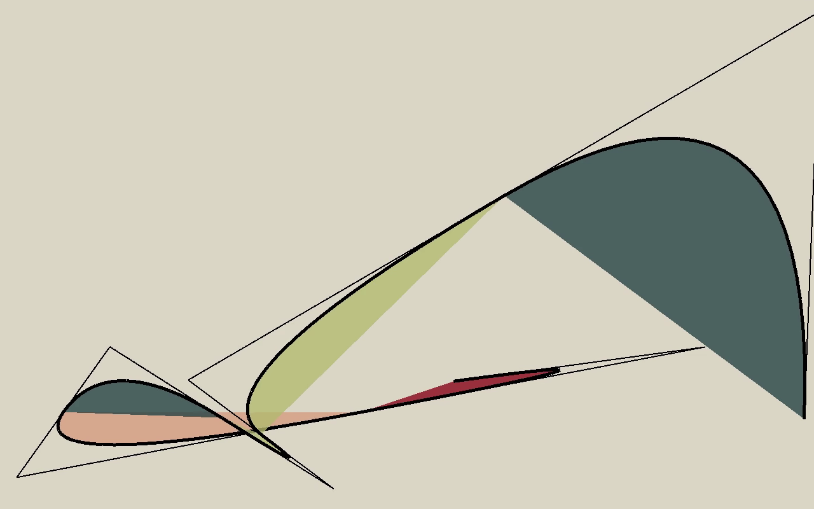
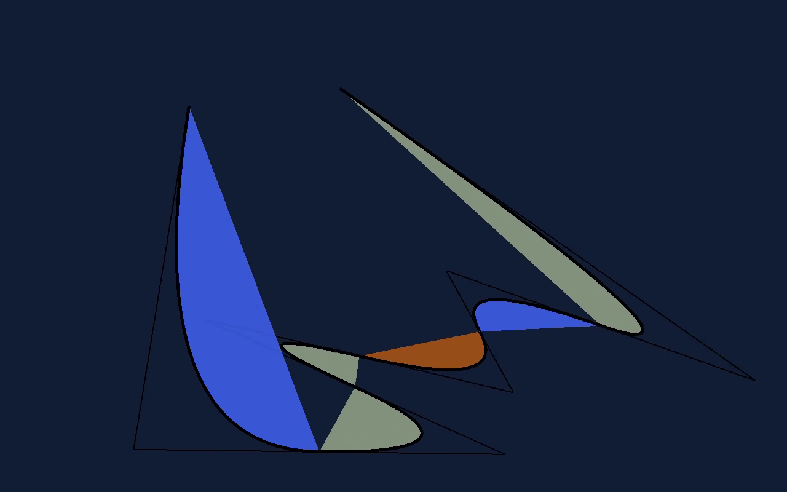
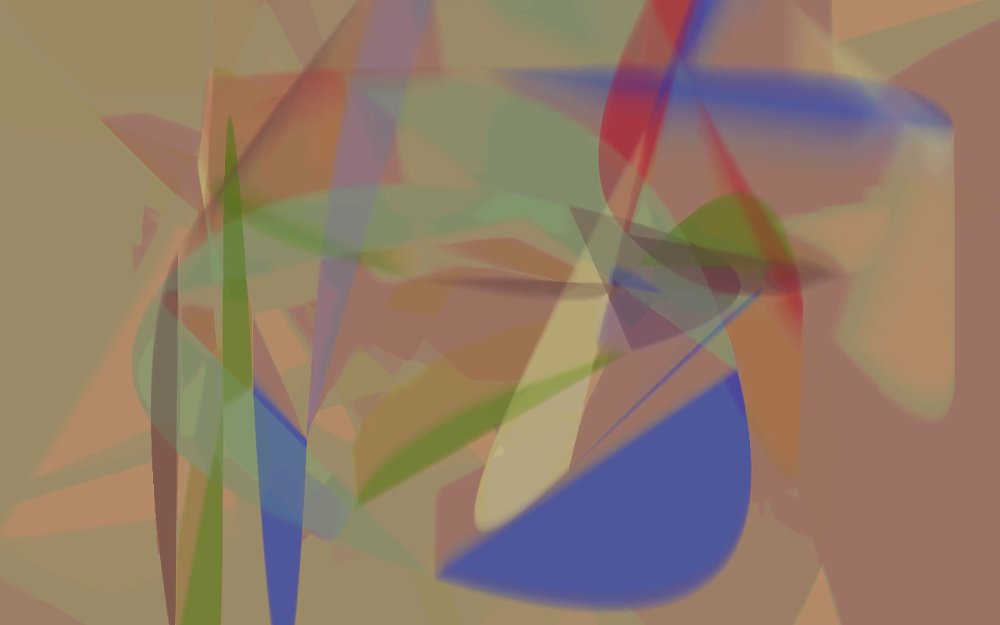
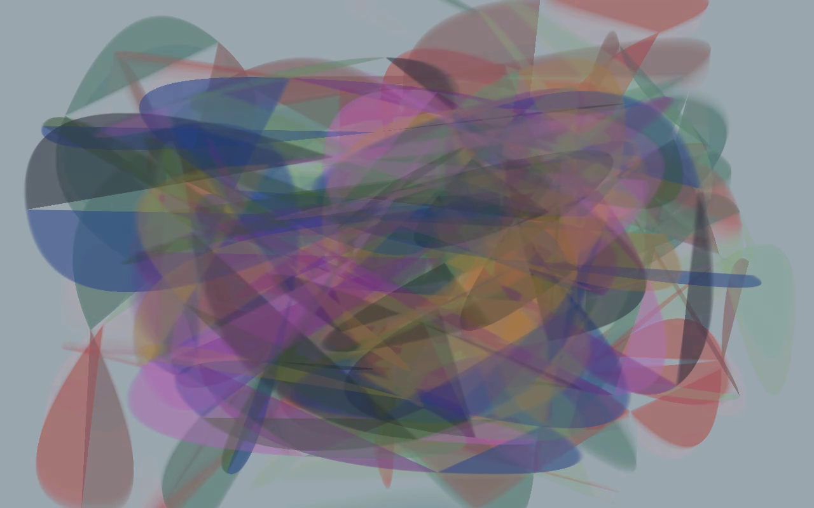
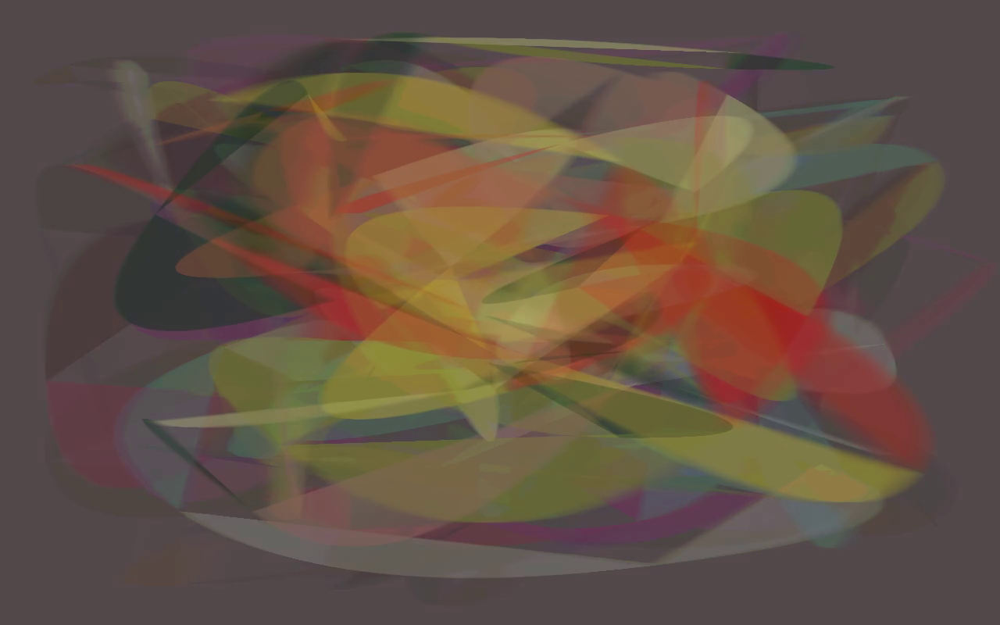

Music visualization. Press keys to change parameters and/or generate a new random scene. Depends on pyray and numpy, and ffmpeg if you want to export a video. Colour patterns are taken from the wonderful book [Spectrum](https://thamesandhudson.com/spectrum-9780500480267).

How to run
----------
Install dependencies:
`pip install -r requirements.txt`
Run it:
`python bez.py`

Screenshots
-----------

Videos
------
[Gallery](https://www.youtube.com/watch?v=tWOhCoADZGA)

[Brimble](https://www.youtube.com/watch?v=n0vmiiZhm7I)

Usage
-----

| Key | Effect |
| --- | ------ |
| spacebar | Create a new random scene with the current parameters |
| Q | Toggle whether to fill the inside or outside part of the curve |
| W | Toggle whether to draw lines (Bezier curve itself and the bezier control lines) |
| + and - | Inc/dec curve length in number of segments |
| E | Toggle whether zoomed in or not |
| R and F | Cycle through pairs of speeds in x and y direction |
| T | Toggle open-ended curve or closed loop |
| Y | Pick a random point and move it to a new random position |
| [ | Start recording (see below) |
| ] | Stop recording (see below) |

Notes on recording
------------------

- Make sure `Recorder.audio` points to an mp3 file
- Press `[`, this will start audio playback and record all your keypresses
- When you are done and the sound is finished, press `]`
- It will now render all the frames again and pipe them to ffmpeg, this can take about 2x or 3x as long as the actual recording
- Finally it will mux the audio and video
